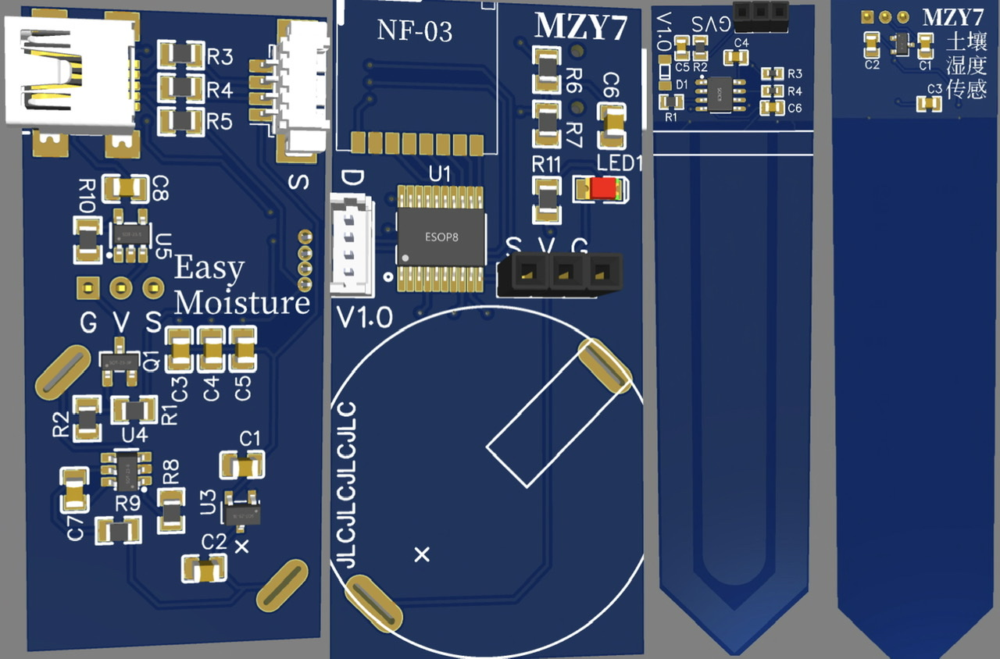
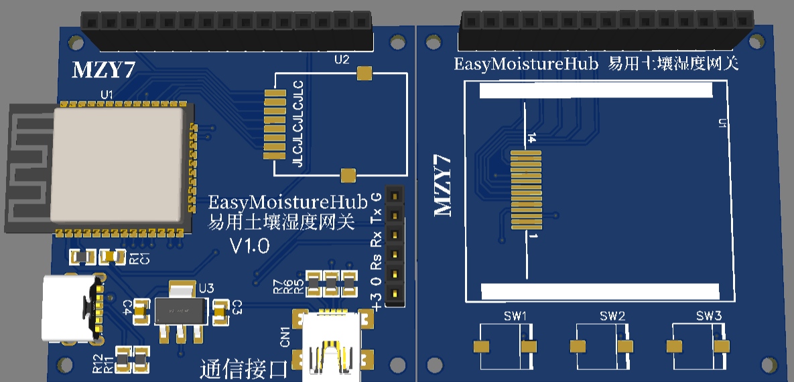

# EasyMoisture 易用土壤湿度传感器

# 产品介绍
喜欢养花花草草却总是忘记浇水？通过无线技术连接土壤湿度传感器，在网关屏幕上、Home Assistant或其他物联网平台中及时获取土壤湿度状况，及时关注你的小花园。  

# 产品特性
待补充……  

# 产品订购
**产品零售价**
- 无线传感器 *¥20.00*  
- 无线网关 *¥50.00*  
  
**订购方式** 【本产品未开放销售】  

[返回首页 <<<](/)  
