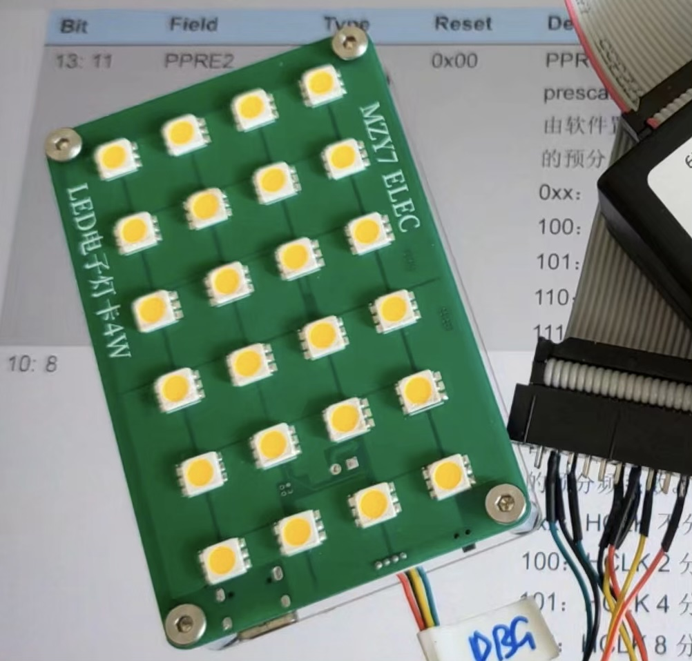

# LEDCard LED电子灯卡4W

## 产品介绍
这款饭卡大小的照明卡采用高显色指数LED灯珠，配合无可见频闪调光方案。配备可编程微控制器，功能可定制升级。

## 产品特性：
- **照明光色**    正白/暖白
- **照明功率**    最大4W，4档可调
- **电池容量**    2500mAh（typ）
- **充电**    typec接口，5V1A输入
- **产品尺寸**    85.5*55mm（饭卡大小）
- **厚度**    8mm（无电池版）/10mm（无电池带外壳版）/18mm（有电池带外壳版）

## 产品订购
**产品零售价：** *¥30.00*  
**订购方式：** 【本产品未开放销售】  
  
[<<< 返回首页](/)  
