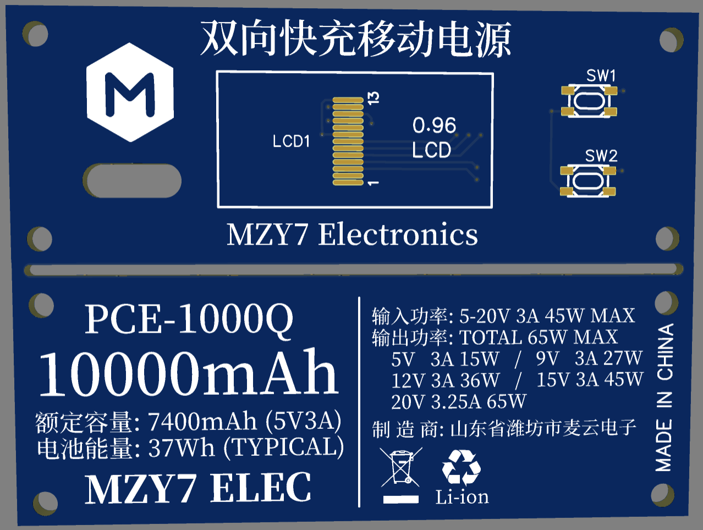

# PCE1000 双向快充移动电源65W

## 产品介绍
这是一款以双向快充为主要特性的移动电源，通过PD协议提供最大65W的输出。同时配备TI的库仑计芯片，保障精确的电量显示与剩余时间预测。在电池温度容许的条件下，输入功率高达45W，可在1小时20分钟内完成自充。采用3节21700锂电池，体积小巧，仅一个手掌大，可轻松携带。

## 产品特性
- **产品型号**    PCE1000
- **电池容量**    10000mAh@3.7V
- **电池能量**    74Wh
- **输入最高功率**    45W@15V+
- **输出最高功率**    65W@20V
- **快充协议支持**    DCP（1.5A）/PD2.0（65W）
- **体积**    26\*71\*106mm（高\*宽\*长）
- **重量**    没称（逃

## 产品订购
**产品零售价：** *¥119.00*
**订购方式：** 【本产品未开放销售】
